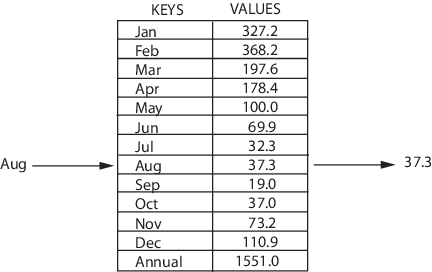

## Встроенные типы и простейшие операции над ними

Классификация типов данных в Python


### 1. Коллекции
Примеры:
```python3
str = "Hello, world!"            # Строка
lst = [1, 2, 5, 4, 1]            # Список
tpl = (1, 3, 3, 4, 8)            # Кортеж
dct = {1: "a", 2: "b", 3: "c"}   # Словарь
st = {1, 3, 4, 99, 3}            # Множество
frznst = frozenset({1, 3, 4, 4}) # Замороженное множество
```

Классификация коллекций в Python


### 2. Последовательности (итераторы)
#### Как проверить, что объект является последовательностью?
```python3
for i in [1, 5, 7, 7, -89]:
    print(i)
```
#### Отличие итератора от обычного объекта
#### Протокол итераций
Протокол итераций - это те свойства, которыми должен обладать объект чтобы его можно было использовать как последовательность
Для того, чтобы объект можно было использовать как последовательность он должен иметь метод **\_\_iter\_\_**, который возвращает итератор
Объект итератора же в свою очередь должен иметь метод **\_\_next\_\_**, который при каждом новом вызове возвращает следующий элемент последовательности
Пример:
```python3
lst = [8, 2, 5, 4]
it = lst.__iter__() # Получение итератора
it.__next__()       # Получение следующего элемента
it.__next__()       # Получение следующего элемента
it.__next__()       # Получение следующего элемента
it.__next__()       # Получение следующего элемента
it.__next__()       # Получение следующего элемента
```
Когда последовательность закончена, метод **\_\_next\_\_** выбрасывает исключение StopIteration
Так как Python позиционирует себя как лаконичный язык, в языке есть такие функции как **iter** и **next**, которые делают вызовы методов **\_\_iter\_\_** и **\_\_next\_\_** более красивыми
Пример:
```python3
lst = [12, 54, 11, 67]
it = iter(lst)
next(it)
next(it)
next(it)
next(it)
next(it)
```
Несложно догадаться, что инструкция __for__ в языке python просто получает итератор объекта, вызывая **\_\_iter\_\_** и на каждый шаг цикла вызывает **\_\_next\_\_**
Система с возвращением итератора кажется сложной и излишней, и действительно, кажется, почему бы не сделать так, чтобы последовательность вместо метода, возвращающего лишний итератор имела просто метод **\_\_next\_\_** и просто возвращала следующий элемент, но у решения с итератором есть разумное зерно.
Представим, что нам понадобилось сравнить каждый элемент последовательности с каждым другим его элементом
```python3
lst = [1, 2, 3]
for i in lst:
    for j in lst:
        # Представим, что здесь мы их сравниваем
        # На самом деле просто посмотрим на i и j
        print(i, j)
```
Так как __lst__ возвращает разные объекты итераторов, то внешний и внутренний цикл не конфликтуют друг с другом. Если бы итератор был бы общий, то внутренний цикл прошёлся бы по нему полностью и закончил бы свою работу, а внешний уже не смог бы им воспользоваться
Пример:
```python3
class List(list):
    def __init__(self, *args):
        super().__init__(args)
        self.index = 0
    
    def __iter__(self):
        return self
      
    def __next__(self):
        if self.index < len(self):
            self.index += 1
            return self[self.index - 1]
        else:
            raise StopIteration

lst = List(1, 2, 3, 4, 5)

for i in lst:
    for j in lst:
        print(i, j)
```
#### Что ещё можно делать с последовательностями
Так как элементы последовательности находятся каждый на своём определённом месте, то можно обращатся к элементу, зная его место в последовательности
```python3
lst = [1, 2, 3, 4, 5]
lst[0]
lst[1]
lst[3]
lst[-2]
lst[-4]
lst[-1]
lst[1] = 5
lst
```
Также кроме определённых элементов можно брать так называемые срезы - подпоследовательности
```python3
lst = [1, 2, 3, 4, 5, 6, 7, 8, 9, 10]
lst[1:5]
lst[-1:3]
lst[5:2]
lst[5:-1]
lst[1:5:2]
lst[-1:3:-2]
lst[5:2:-1]
lst[5:-1:-1]

lst
lst[1:4] = [1]
lst
lst[8:-1] = [2]
lst
```
### 3. Изменяемые и неизменяемые объекты
Объекты (а именно последовательности) в Python делятся на изменяемые (mutable) и неизменяемые (immutable) объекты.
#### Чем они отличаются и как это влияет на код?
Самые явные представители изменямыех и неизменяемых объектов - это список (list) и кортеж (tuple)
Пример:
```python3
lst = [1, 2, 3]
tpl = (1, 2, 3)

lst[0] = 4
tpl[0] = 4
```
Как видно из примера, изменить отдельный элемент в кортеже нельзя
### 4. Отображения
Из стандартных типов только словарь является отображением
#### Чем отличается словарь от всех остальных типов данных
Словарь содержит в себе структуру ключ-значение

Ключ-значение



Пример:
```python3
dct = {"key1": 89432, "key2": 78, 1: 98, 5.89: 11}

dct["key1"]
dct["key2"]
dct[1]
dct[5.89]
```
### 5. Строки
Строка - это последовательность символов. Строка является неизменяемой последовательностью
#### Базовые операции
* Конкатенация (сложение)
```python3
S1 = 'spam'
S2 = 'eggs'
S1 + S2
```
* Дублирование строки
```python3
'spam' * 3
```
* Длина строки (функция len)
```python3
len('spam')
```
* Доступ по индексу
```python3
S = 'spam'
S[0]
S[2]
S[-2]
```
Как видно из примера, в Python возможен и доступ по отрицательному индексу, при этом отсчет идет от конца строки.
* Извлечение среза
  Оператор извлечения среза: [X:Y]. X – начало среза, а Y – окончание;
  символ с номером Y в срез не входит. По умолчанию первый индекс равен 0, а второй - длине строки.
```python3
s = 'spameggs'
s[3:5]
s[2:-2]
s[:6]
s[1:]
s[:]
# Кроме того, можно задать шаг, с которым нужно извлекать срез.
s[::-1]
s[3:5:-1]
s[2::2]
```
#### Другие функции и методы строк
При вызове методов необходимо помнить, что строки в Python относятся к категории неизменяемых последовательностей, то есть все функции и методы могут лишь создавать новую строку.
```python3
s = 'spam'
s[1] = 'b'
s = s[0] + 'b' + s[2:]
s
```
Поэтому все строковые методы возвращают новую строку, которую потом следует присвоить переменной.
#### Таблица "Функции и методы строк"
Функция или метод	Назначение
* S = 'str'; S = "str"; S = '''str'''; S = """str""" - Литералы строк
* S = "s\np\ta\nbbb"	                               - Экранированные последовательности
* S = r"C:\temp\new"                                 - Неформатированные строки (подавляют экранирование)
* S = b"byte"	                                       - Строка байтов
* S1 + S2                                            - Конкатенация (сложение строк)
* S1 * 3                                             - Повторение строки
* S[i]                                               - Обращение по индексу
* S[i:j:step]                                        - Извлечение среза
* len(S)                                             - Длина строки
* S.find(str, [start],[end])                         - Поиск подстроки в строке. Возвращает номер первого вхождения или -1
* S.rfind(str, [start],[end])                        - Поиск подстроки в строке. Возвращает номер последнего вхождения или -1
* S.index(str, [start],[end])                        - Поиск подстроки в строке. Возвращает номер первого вхождения или вызывает ValueError
* S.rindex(str, [start],[end])                       - Поиск подстроки в строке. Возвращает номер последнего вхождения или вызывает ValueError
* S.replace(шаблон, замена)                          - Замена шаблона
* S.split(символ)                                    - Разбиение строки по разделителю
* S.isdigit()                                        - Состоит ли строка из цифр
* S.isalpha()                                        - Состоит ли строка из букв
* S.isalnum()                                        - Состоит ли строка из цифр или букв
* S.islower()                                        - Состоит ли строка из символов в нижнем регистре
* S.isupper()                                        - Состоит ли строка из символов в верхнем регистре
* S.isspace()                                        - Состоит ли строка из неотображаемых символов (пробел, символ перевода страницы ('\f'), "новая строка" ('\n'), "перевод каретки" ('\r'), "горизонтальная табуляция" ('\t') и "вертикальная табуляция" ('\v'))
* S.istitle()	                                       - Начинаются ли слова в строке с заглавной буквы
* S.upper()	                                         - Преобразование строки к верхнему регистру
* S.lower()	                                         - Преобразование строки к нижнему регистру
* S.startswith(str)                                  - Начинается ли строка S с шаблона str
* S.endswith(str)                                    - Заканчивается ли строка S шаблоном str
* S.join(список)                                     - Сборка строки из списка с разделителем S
* ord(символ)                                        - Символ в его код ASCII
* chr(число)                                         - Код ASCII в символ
* S.capitalize()                                     - Переводит первый символ строки в верхний регистр, а все остальные в нижний
* S.center(width, [fill])                            - Возвращает отцентрованную строку, по краям которой стоит символ fill (пробел по умолчанию)
* S.count(str, [start],[end])                        - Возвращает количество непересекающихся вхождений подстроки в диапазоне [начало, конец] (0 и длина строки по умолчанию)
* S.expandtabs([tabsize])                            - Возвращает копию строки, в которой все символы табуляции заменяются одним или несколькими пробелами, в зависимости от текущего столбца. Если TabSize не указан, размер табуляции полагается равным 8 пробелам
* S.lstrip([chars])                                  - Удаление пробельных символов в начале строки
* S.rstrip([chars])                                  - Удаление пробельных символов в конце строки
* S.strip([chars])                                   - Удаление пробельных символов в начале и в конце строки
* S.partition(шаблон)                                - Возвращает кортеж, содержащий часть перед первым шаблоном, сам шаблон, и часть после шаблона. Если шаблон не найден, возвращается кортеж, содержащий саму строку, а затем две пустых строки
* S.rpartition(sep)                                  - Возвращает кортеж, содержащий часть перед последним шаблоном, сам шаблон, и часть после шаблона. Если шаблон не найден, возвращается кортеж, содержащий две пустых строки, а затем саму строку
* S.swapcase()                                       - Переводит символы нижнего регистра в верхний, а верхнего – в нижний
* S.title()                                          - Первую букву каждого слова переводит в верхний регистр, а все остальные в нижний
* S.zfill(width)                                     - Делает длину строки не меньшей width, по необходимости заполняя первые символы нулями
* S.ljust(width, fillchar=" ")                       - Делает длину строки не меньшей width, по необходимости заполняя последние символы символом fillchar
* S.rjust(width, fillchar=" ")                       - Делает длину строки не меньшей width, по необходимости заполняя первые символы символом fillchar
* S.format(*args, **kwargs)                          - Форматирование строки
### 6. Списки
Списки в Python - упорядоченные изменяемые коллекции объектов произвольных типов (почти как массив, но типы могут отличаться).
Чтобы использовать списки, их нужно создать. Создать список можно несколькими способами. Например, можно обработать любой итерируемый объект (например, строку) встроенной функцией list:
```python3
list('список')
```

Список можно создать и при помощи литерала:
```python3
[]
['s', 'p', ['isok'], 2]
```
Как видно из примера, список может содержать любое количество любых объектов (в том числе и вложенные списки), или не содержать ничего.
И еще один способ создать список - это генераторы списков. Генератор списков - способ построить новый список, применяя выражение к каждому элементу последовательности. Генераторы списков очень похожи на цикл for.
```python3
[c * 3 for c in 'list']
```
Возможна и более сложная конструкция генератора списков:
```python3
c = [c * 3 for c in 'list' if c != 'i']
c
c = [c + d for c in 'list' if c != 'i' for d in 'spam' if d != 'a']
c
```
Но в сложных случаях лучше пользоваться обычным циклом for для генерации списков.
#### Таблица "методы списков"
* list.append(x)                 - Добавляет элемент в конец списка
* list.extend(L)                 - Расширяет список list, добавляя в конец все элементы списка L
* list.insert(i, x)              - Вставляет на i-ый элемент значение x
* list.remove(x)                 - Удаляет первый элемент в списке, имеющий значение x. ValueError, если такого элемента не существует
* list.pop([i])                  - Удаляет i-ый элемент и возвращает его. Если индекс не указан, удаляется последний элемент
* list.index(x, [start [, end]]) - Возвращает положение первого элемента со значением x (при этом поиск ведется от start до end)
* list.count(x)                  - Возвращает количество элементов со значением x
* list.sort([key=функция])       - Сортирует список на основе функции
* list.reverse()                 - Разворачивает список
* list.copy()                    - Поверхностная копия списка
* list.clear()                   - Очищает список
Нужно отметить, что методы списков, в отличие от строковых методов, изменяют сам список, а потому результат выполнения не нужно записывать в эту переменную.
```python3
l = [1, 2, 3, 5, 7]
l.sort()
l
l = l.sort()
l
```
И, напоследок, примеры работы со списками:
```python3
a = [66.25, 333, 333, 1, 1234.5]
a.count(333), a.count(66.25), a.count('x')
a.insert(2, -1)
a.append(333)
a
a.index(333)
a.remove(333)
a
a.reverse()
a
a.sort()
a
```
### 7. Кортежи
#### Зачем нужны кортежи, если есть списки?
* Защита от дурака. То есть кортеж защищен от изменений, как намеренных (что плохо), так и случайных (что хорошо).
* Меньший размер. Дабы не быть голословным:
```python3
a = (1, 2, 3, 4, 5, 6)
b = [1, 2, 3, 4, 5, 6]
a.__sizeof__()
b.__sizeof__()
```
Возможность использовать кортежи в качестве ключей словаря:
```python3
d = {(1, 1, 1) : 1}
d
d = {[1, 1, 1] : 1}
```
#### Как работать с кортежами?
С преимуществами кортежей разобрались, теперь встает вопрос - а как с ними работать. Примерно так же, как и со списками.
```python3
# Создаем пустой кортеж:
a = tuple() # С помощью встроенной функции tuple()
a
a = () # С помощью литерала кортежа
a
# Создаем кортеж из одного элемента:
a = ('s')
a
# Стоп. Получилась строка. Но как же так? Мы же кортеж хотели! Как же нам кортеж получить?
a = ('s', )
a
```
Ура! Заработало! Все дело - в запятой. Сами по себе скобки ничего не значат, точнее, значат то, что внутри них находится одна инструкция, которая может быть отделена пробелами, переносом строк и прочим мусором. Кстати, кортеж можно создать и так:
```python3
a = 's',
a
```
Но все же не увлекайтесь, и ставьте скобки, тем более, что бывают случаи, когда скобки необходимы.
Ну и создать кортеж из итерируемого объекта можно с помощью все той же пресловутой функции tuple()
```python3
a = tuple('hello, world!')
a
```
#### Операции с кортежами
Все операции над списками, не изменяющие список (сложение, умножение на число, методы index() и count() и некоторые другие операции). Можно также по-разному менять элементы местами и так далее.
Например, гордость программистов на python - поменять местами значения двух переменных:
```python3
a, b = b, a
```
### 8. Словари
Словари в Python - неупорядоченные коллекции произвольных объектов с доступом по ключу. Их иногда ещё называют ассоциативными массивами или хеш-таблицами.
Чтобы работать со словарём, его нужно создать. Создать его можно несколькими способами. Во-первых, с помощью литерала:
```python3
d = {}
d
d = {'dict': 1, 'dictionary': 2}
d
```
Во-вторых, с помощью функции dict:
```python3
d = dict(short='dict', long='dictionary')
d
d = dict([(1, 1), (2, 4)])
d
```
В-третьих, с помощью метода fromkeys:
```python3
d = dict.fromkeys(['a', 'b'])
d
d = dict.fromkeys(['a', 'b'], 100)
d
```
В-четвертых, с помощью генераторов словарей, которые очень похожи на генераторы списков.
```python3
d = {a: a ** 2 for a in range(7)}
d
```
Теперь попробуем добавить записей в словарь и извлечь значения ключей:
```python3
d = {1: 2, 2: 4, 3: 9}
d[1]
d[4] = 4 ** 2
d
d['1']
```
Как видно из примера, присвоение по новому ключу расширяет словарь, присвоение по существующему ключу перезаписывает его, а попытка извлечения несуществующего ключа порождает исключение. Для избежания исключения есть специальный метод (см. ниже), или можно перехватывать исключение.
Что же можно еще делать со словарями? Да то же самое, что и с другими объектами: встроенные функции, ключевые слова (например, циклы for и while), а также специальные методы словарей.
#### Методы словарей
* dict.clear()                            - очищает словарь.
* dict.copy()                             - возвращает копию словаря.
* classmethod dict.fromkeys(seq[, value]) - создает словарь с ключами из seq и значением value (по умолчанию None).
* dict.get(key[, default])                - возвращает значение ключа, но если его нет, не бросает исключение, а возвращает default (по умолчанию None).
* dict.items()                            - возвращает пары (ключ, значение).
* dict.keys()                             - возвращает ключи в словаре.
* dict.pop(key[, default])                - удаляет ключ и возвращает значение. Если ключа нет, возвращает default (по умолчанию бросает исключение).
* dict.popitem()                          - удаляет и возвращает пару (ключ, значение). Если словарь пуст, бросает исключение KeyError. Помните, что словари неупорядочены.
* dict.setdefault(key[, default])         - возвращает значение ключа, но если его нет, не бросает исключение, а создает ключ с значением default (по умолчанию None).
* dict.update([other])                    - обновляет словарь, добавляя пары (ключ, значение) из other. Существующие ключи перезаписываются. Возвращает None (не новый словарь!).
* dict.values()                           - возвращает значения в словаре.
### 9. Множества
#### Что такое множество?
Множество в python - "контейнер", содержащий не повторяющиеся элементы в случайном порядке.
Создаём множества:
```python3
a = set()
a
a = set('hello')
a
a = {'a', 'b', 'c', 'd'}
a
a = {i ** 2 for i in range(10)} # генератор множеств
a
a = {}  # А так нельзя!
type(a)
```
Как видно из примера, множества имеет тот же литерал, что и словарь, но пустое множество с помощью литерала создать нельзя.
Множества удобно использовать для удаления повторяющихся элементов:
```python3
words = ['hello', 'daddy', 'hello', 'mum']
set(words)
```
#### Операции с множествами
* len(s)                                             - число элементов в множестве (размер множества).
* x in s                                             - принадлежит ли x множеству s.
* set.isdisjoint(other)                              - истина, если set и other не имеют общих элементов.
* set == other                                       - все элементы set принадлежат other, все элементы other принадлежат set.
* set.issubset(other) или set <= other               - все элементы set принадлежат other.
* set.issuperset(other) или set >= other             - аналогично.
* set.union(other, ...) или set | other | ...        - объединение нескольких множеств.
* set.intersection(other, ...) или set & other & ... - пересечение.
* set.difference(other, ...) или set - other - ...   - множество из всех элементов set, не принадлежащие ни одному из other.
* set.symmetric_difference(other); set ^ other       - множество из элементов, встречающихся в одном множестве, но не встречающиеся в обоих.
* set.copy()                                         - копия множества.
#### Операции, непосредственно изменяющие множество:
* set.update(other, ...); set |= other | ...              - объединение.
* set.intersection_update(other, ...); set &= other & ... - пересечение.
* set.difference_update(other, ...); set -= other | ...   - вычитание.
* set.symmetric_difference_update(other); set ^= other    - множество из элементов, встречающихся в одном множестве, но не встречающиеся в обоих.
* set.add(elem)                                           - добавляет элемент в множество.
* set.remove(elem)                                        - удаляет элемент из множества. KeyError, если такого элемента не существует.
* set.discard(elem)                                       - удаляет элемент, если он находится в множестве.
* set.pop()                                               - удаляет первый элемент из множества. Так как множества не упорядочены, нельзя точно сказать, какой элемент будет первым.
* set.clear()                                             - очистка множества.
### 10. Замороженные множества
Единственное отличие set от frozenset заключается в том, что set - изменяемый тип данных, а frozenset - нет. Примерно похожая ситуация с списками и кортежами.
```python3
a = set('qwerty')
b = frozenset('qwerty')
a == b
True
type(a - b)
type(a | b)
a.add(1)
b.add(1)
```
### 11. Вложенные списки (матрицы)
Из списков, не смотря на их простую структуру, можно создавать довольно сложные и интересные системы.
В Python нет понятия как массивов, так и многомерных массивов. Но здесь они и не нужны, все базовые типы данных гибки настолько, что с помощью них можно реализовать любую привычную структуру из других языков программирования.
#### Что такое многомерные массивы?
Да, у массивов может быть несколько измерений. Конечно, на практике четырёхмерные и более массивы не применяются совсем, так что рассматривать мы их не будем, а затронем только тему двумерных и, возможно, трёхмерных массивов.
Что из себя представляет двумерный массив?
Самое удобная ассоциация для двумерного массива - это таблица.
Двумерный массив


Такую же "таблицу" (а лучше всё-таки сказать массив) из чисел мы можем получить и с помощью языка Python
```python3
matrix = [[1, 2, 3, 4, 5],
          [2, 4, 6, 8, 9],
          [3, 6, 9, 12, 15],
          [4, 8, 12, 16, 20],
          [5, 10, 15, 20, 25]]
matrix
for row in matrix:
    print(row)
```
По сути, двумерный массив - это список, состоящий из списков. Необязательно использовать именно списки, могут подойти и кортежи, но только в том случае, если вы не собираетесь изменять элементы матрицы
В математике такие двумерные массивы называют матрицами, и для них есть собственная логика, операции и прочее
### 12. Практическая работа
Пусть дано три текста (переменные типа **string**).
1. Сложить все три текста в один (в одну переменную типа **string**).
2. Показать все символы, которые встречаются в тексте.
3. Вывести все символы, которые встречаются во всех трёх текстах.
